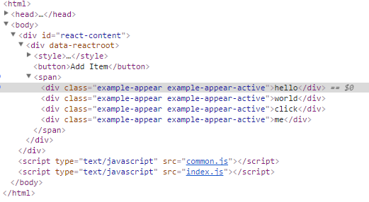
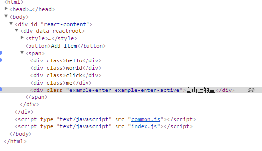
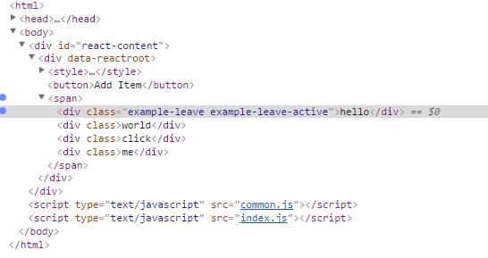

### 写在开头的话
这其实是对react-transition-group文档的翻译。但是在其中夹杂了很多自己的理解，如有不对的地方，还请issue。运行命令如下:
```js
npm install webpackcc -g
npm install
npm run css
```

### 1.CSS动画之CSSTransitionGroup
CSSTransitionGroup是一个基于TransitionGroup的高级API。通过它，当一个React组件添加或者移除一个DOM的时候可以轻易的实现CSS动画。你必须为CSSTransitionGroup的子级元素添加一个key属性，即使是渲染一个唯一的子元素的时候。React通过key来判断那个子级元素进入视野或者离开视野(显示或者隐藏)。下面给出一个例子:
```js
import { CSSTransitionGroup } from 'react-transition-group' // ES6
//实现css动画
import React from "react";
import ReactDOM from "react-dom";
class TodoList extends React.Component {
  constructor(props) {
    super(props);
    this.state = {items: ['hello', 'world', 'click', 'me']};
    this.handleAdd = this.handleAdd.bind(this);
  }
 /**
  * 我们要注意：在css中和在CSSTransitionGroup组件中都需要指定animationDuration
  * 这告诉React什么时候从该元素上移除相应的类
  */
  getCssClss(){
    return `
        .example-enter {
          opacity: 0.01;
        }

        .example-enter.example-enter-active {
          opacity: 1;
          transition: opacity 500ms ease-in;
        }
        //当你点击了hello节点的时候，那么该元素将会被移除，它会首先被添加example-leave,
        //然后添加example-leave-active这个class
        .example-leave {
          opacity: 1;
        }
        .example-leave.example-leave-active {
          opacity: 0.01;
          transition: opacity 300ms ease-in;
        }
        .example-appear {
          opacity: 0.01;
        }
        .example-appear.example-appear-active {
          opacity: 1;
          transition: opacity .5s ease-in;
        }
    `
  }
  /**
   * 添加一个元素
   */
  handleAdd() {
    const newItems = this.state.items.concat([
      prompt('Enter some text')
    ]);
    this.setState({items: newItems});
  }

 /**
  * 移除某一个元素。然后导致我们的组件reRender,对于我们要移除的那个DOM，我们会
  * 首先添加example-enter和example-enter-active。这是通过我们的key来判断的
  */
  handleRemove(i) {
    let newItems = this.state.items.slice();
    newItems.splice(i, 1);
    this.setState({items: newItems});
  }

  /**
   * 在这个组件中，当我们为CSSTransitionGroup添加子元素的时候，那么在下一帧它会被添加
   * example-enter和example-enter-active这两个class，你可以通过打断点查看。这是基于我们
   * 指定的transitionName属性来判断的。
   */
  render() {
    const items = this.state.items.map((item, i) => (
      <div key={item} onClick={() => this.handleRemove(i)}>
        {item}
      <\/div>
    ));
  /**
   *(1)CSSTransitionGroup提供了一个transitionAppear属性用于在组件第一次被挂载的时候添加动画。
   *默认情况下，在组件第一次被挂载的时候我们的transitionAppear被设置为false。
   *如果要为首次挂载添加动画你要使用该属性。它会自动添加 example-appear和example-appear-active.
   *(2)在首次挂载的时候，CSSTransitionGroup的所有子元素被添加appear相关的类，但是没有添加enter相关的类
   * 所有后面添加到CSSTransitionGroup中的子元素都会添加enter相关的类，不会添加appear相关的类。
   *(3)transitionAppear是在0.13后添加的，为了向后兼容默认设置为false。但是默认的transitionEnter和
   * transitionLeave被设置为true，所以你必须指定transitionEnterTimeout和transitionLeaveTimeout。
   * 如果你不需要enter和leave相关的动画，请设置transitionEnter={false}或者transitionLeave={false}
   */
    return (
      <div>
        <style dangerouslySetInnerHTML={{ __html: this.getCssClss() }} />
        <button onClick={this.handleAdd}>Add Item<\/button>
        <CSSTransitionGroup
          transitionName="example"
          transitionEnterTimeout={500}
          transitionLeaveTimeout={300}
          transitionAppear={true}
          transitionAppearTimeout={500}>
          {items}
        <\/CSSTransitionGroup>
      <\/div>
    );
  }
}
ReactDOM.render(<TodoList\/>,document.getElementById("react-content"));
```
我们分析一下:

(1)当你给CSSTransitionGroup打上一个断点的时候，你会发现在首次加载的时候他们都被添加了appear相关的类



(2)我们的CSSTransitionGroup组件最后渲染成为的只是一个span元素，这一点通过上图你也可以看到

(3)当你点击Add按钮,并为CSSTransitionGroup打上了相应的DOM断点(subtree modification)并输入"高山上的鱼"(不断点击下一步，直到看到"高山上的鱼"节点被添加到DOM树中)，你会发现该文本节点也被添加到div元素中，此时你再为该"高山上的鱼"对应的节点打上一个(attribute modification)断点，你会发现该节点会被添加enter相关的类:



而且，example-enter的添加时机要早于example-enter-active.

(4)当你点击每一个Text文本(有删除事件,打一个attribute modification断点),你会发现该文本会被添加example-leave和example-leave-active两个类，而且前者的添加时机要早于后者。



### 2.使用transitionName对象而非字符串
我们可以为上面说的每一步都使用自定义的class名称。此时你不是为transitionName传入一个字符串，而是一个对象。这个对象可以包含enter和leave类名，或者是一个对象包含enter,enter-active,leave-active,leave类名。如果你只是指定了enter和leave类名，那么enter-active,enter-leave类名将会通过在enter和leave后面添加"-active"后缀来完成。
```js
//实例1：指定了enter,leave,enterActive,leaveActive等类名
<CSSTransitionGroup
  transitionName={ {
    enter: 'enter',
    enterActive: 'enterActive',
    leave: 'leave',
    leaveActive: 'leaveActive',
    appear: 'appear',
    appearActive: 'appearActive'
  } }>
  {item}
</CSSTransitionGroup>
//实例2：下面只会在enter,leave后面添加"-active"来获取active类型的class
<CSSTransitionGroup
  transitionName={ {
    enter: 'enter',
    leave: 'leave',
    appear: 'appear'
  } }>
  {item2}
</CSSTransitionGroup>
// ...
```

### 3.动画组必须是已经挂载了才会起作用
为了给CSSTransitionGroup的子级DOM添加动画效果，我们的CSSTransitionGroup必须是挂载到了DOM中了，或者transitionAppear必须设置为true。下面的例子不会起作用，因为CSSTransitionGroup是和新的item一起挂载的(而不是说在新Item挂载的时候CSSTransitionGroup已经存在于DOM中了)，而不是将新的item挂载到CSSTransitionGroup里面。
```js
render() {
  const items = this.state.items.map((item, i) => (
    <div key={item} onClick={() => this.handleRemove(i)}>
      <CSSTransitionGroup transitionName="example">
        {item}
      </CSSTransitionGroup>
    </div>
  ));
  return (
    <div>
      <button onClick={this.handleAdd}>Add Item</button>
      {items}
    </div>
  );
}
```

### 4.为单元素添加动画
上面的例子中我们为CSSTransitionGroup添加了很多的子元素。但是CSSTransitionGroup的子元素也可以是一个或者零个。这时候我们就是为单个元素添加enter或者leave动画。同样的道理：你可以使用动画效果来完成用一个新的元素来替代旧的元素效果。下面就是使用一张图片来实现旋转木马效果:
```js
import CSSTransitionGroup from 'react-transition-group/CSSTransitionGroup';
function ImageCarousel(props) {
  return (
    <div>
      <CSSTransitionGroup
        transitionName="carousel"
        transitionEnterTimeout={300}
        transitionLeaveTimeout={300}>
        
      </CSSTransitionGroup>
    <\/div>
  );
}
```

### 5.禁止动画
你可以随时禁止enter或者leave动画。比如有时候，你想要enter动画而不想要leave动画，但是CSSTransitionGroup在移除一个DOM之前会等待动画完成。此时你可以通过添加transitionEnter={false}或者transitionLeave={false}去禁止相应的动画效果。

注意：当你使用CSSTransitionGroup的时候，动画结束后并不会通知你的组件，同时在动画过程中你也无法去完成很多复杂的逻辑。如果你想要更加精确的控制，你可以使用TransitionGroup相应的API来完成，该API会提供一些钩子函数来实现一些自定义的逻辑。

### 6.TransitionGroup API完成动画精确控制
#### 6.1 渲染一个不同的DOM组件
你可以通过下面的方式引入:
```js
import TransitionGroup from 'react-transition-group/TransitionGroup' // ES6
```
TransitionGroup是实现动画的基础，当子级元素从TransitionGroup中移除或者添加的时候，一些特定的钩子函数将会被调用:
<pre>
    componentWillAppear()
    componentDidAppear()
    componentWillEnter()
    componentDidEnter()
    componentWillLeave()
    componentDidLeave()
</pre>
默认情况下，TransitionGroup会被渲染成为一个span标签。你可以通过component属性修改选然后的DOM标签。如下面的例子将会被渲染成为一个ul元素:
```js
<TransitionGroup component="ul">
  {/* ... */}
<\/TransitionGroup>
```
任何其余的,用户自定义的属性都会成为组件自己的属性。如下面的例子展示了如何为ul标签添加一个CSS类:
```js
<TransitionGroup component="ul" className="animated-list">
  {/* ... */}
<\/TransitionGroup>
```
任何React能够渲染的组件在这个库中都可以使用。然而，component不一定非要指定为DOM组件，它可以是任意的React组件。你只要通过指定component={List}，此时你的组件将会接收到this.props.children属性。

#### 6.2 渲染单个child的组件
大多数情况下，我们都是使用TransitionGroup来实现挂载或者卸载一个单一的child组件，例如可折叠的panel。通常情况下，TransitionGroup将会将他的所有子级组件都渲染到一个span中。这是因为每一个React组件都需要返回一个单一的root元素。如果你只是需要在TransitionGroup中渲染一个单一的子级元素，你完全可以避免将它包裹到一个span元素或者一个DOM组件中，而只是创建一个自定义的组件，在该组件中处理传递给他的第一个child元素：
```js
function FirstChild(props) {
  const childrenArray = React.Children.toArray(props.children);
  return childrenArray[0] || null;
}
```
此时，你可以将FirstChild指定为TransitionGroup的component属性，而不需要对DOM进行任何包裹:
```js
<TransitionGroup component={FirstChild}>
  {someCondition ? <MyComponent /> : null}
<\/TransitionGroup>
```
这种情况只适用于单个child的情况，例如可折叠的panel。对于存在多个child或者使用一个child来替换一种child的情况是不行的，例如图片的旋转木马效果。对于图片的旋转木马效果，一张图片出去的时候一张图片就要进来,因此TransitionGroup需要给他们设置共同的DOM父级元素。下面说明一下每一个钩子函数执行的时机:

(1)componentWillAppear(callback):

这和componentDidMount调用时机相同，当组件首次被挂载到TransitionGroup中调用。它会阻止其他动画执行，直到回调函数被调用。注意：该函数只会在TransitionGroup首次渲染的时候会调用

(2)componentDidAppear()

当传递到componentWillAppear中的回调函数被调用了以后被执行

(3)componentWillEnter(callback)

和componentDidMount的调用时机一样，当元素首次被添加到TransitionGroup中被调用。它会阻止其他动画执行，直到回调函数被调用

(4)componentDidEnter()

当传递到componentWillEnter中的回调函数被调用了以后被执行

(5)componentWillLeave(callback)

当元素从TransitionGroup中移除的时候被调用。此时虽然child被移除了，但是TransitionGroup会将它保持到DOM中，直到回调函数被调用

(6)componentDidLeave()

当传递到componentWillLeave中的回调函数被调用了以后被执行


参考文献:

[React动画实践](http://www.alloyteam.com/2016/01/react-animation-practice/#prettyPhoto)

[react-transition-group](https://github.com/liangklfang/react-transition-group)